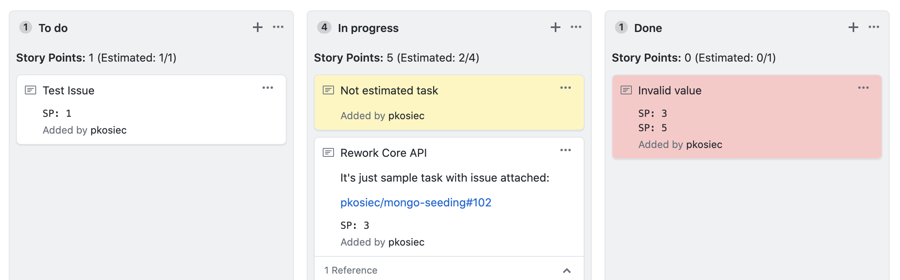

# GitHub Projects Story Points

Use Story Points in GitHub Project board without a hassle. No labels or issue title modifications needed.



> **NOTE:** This script is in a very early stage. Use it at your own risk.

## Motivation

There are plenty of similar tools. However, all existing plugins or scripts I found base on Github labels or tags in task titles, which doesn't look professional. I prepared the script to keep the estimations internal, visible only on GitHub Project boards. The boards can set as private, which means this script allows to show Story Points only for authors or organization members.

## Installation

1. Install [Tampermonkey](http://www.tampermonkey.net/) plugin for your favorite web browser.
2. Navigate to the [GitHub Project Story Points User Script](https://raw.githubusercontent.com/pkosiec/github-projects-story-points/master/script.user.js) location. The script format is detected automatically and Tampermonkey will ask to install it.
3. Tampermonkey will watch the script version from installed location and if necessary, it will update the script automatically.

## Usage

1. Navigate to your GitHub Project board.
1. Add a note to a column with a task description.
    > **NOTE**: To reference actual issue, paste a link into the note.
1. To define your Story Points value, include the following codeblock:
     ~~~
     ```est
     SP: {value}
     ```
     ~~~
     
     For example, for Story Points value of 3, the actual codeblock is:
     ~~~
     ```est
     SP: 3
     ```
     ~~~
1. Observe Story Point Column Summary update.

    > **NOTE:** Currently, the script refreshes the Story Point summary every 3 seconds.

## Examples

To see a live example, navigate to the [sample GitHub Project](https://github.com/pkosiec/gh-projects-story-points/projects/1).